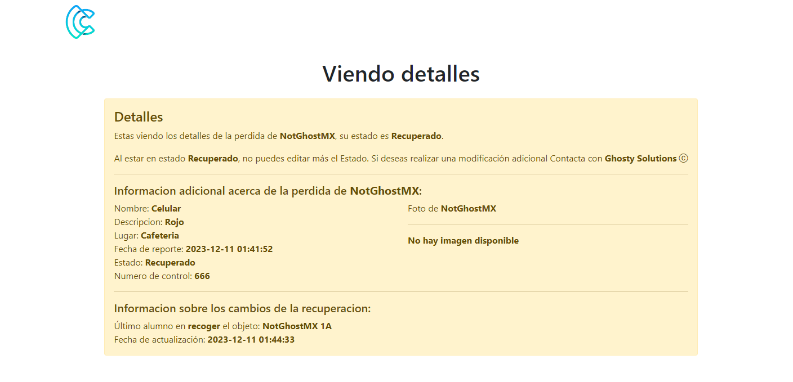

# 🌟 Sistema de objetos perdidos 🌟

## 📖 Descripción

Hice este proyecto como trabajo final de una materia de programación. Además de poder crear una solución efectiva en mi entorno escolar.
Se trata de un sistema de reporte de objetos perdidos, los cuales vas a dar de alta en un CRUD.
Tú como Administrador podrás llenar varios campos para tener información detallada del objeto y también cambiar sus <bold>estados<bold> para saber si ya se econtró, o fue recuperado por alguna otra persona
que también tendrás que dar de alta en el sistema para hacer su registro.
Esto con la finalidad de que aparezca en los registros de cambios de estado y puedas ver que persona entregó/recogió/perdió el objeto.

🛠️ Construido con
* PHP - PHP del lado del sevidor para manejar las peticiones GET/POST/UPDATE/DELETE de manera sencilla usando solo PHP sin crear endpoints.
* Bootstrap - Como framework de CSS decidi darle uso a bootstrap para facilitar la maquetación del sitio web y su minimalismo.

🔧 Instalacion
* Usar XAMPP instalado en localhost para abrir conexión con MYSQL

* Preview de la aplicación

